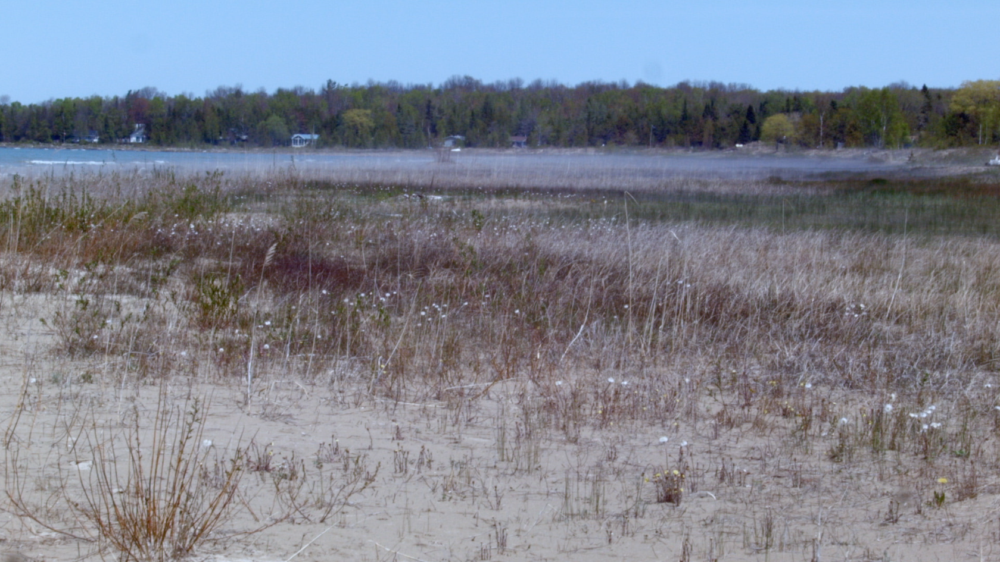

# Lensing

Lensing emphasizes transformational interactions amongst artworks, bodies, and concepts. Literally, a lens is a tool for focussing, bending, magnifying, or distorting light by means of refraction. The nature and extent of this refraction is always influenced by the characteristics of the lens itself, its material and curvature. Lenses are never a fully transparent instrument, insofar as they always lend their own particular qualities to the images they transmit--or rather, mediate. As methodological tools, lenses are active apparatuses1. They imply a perspective and a relationality; their effects change and shift based on distance, the space around them, and time spent with them. My emphasis here is on the verb form: "to lens" (with the corresponding gerund lensing), which should be understood as a form of technologically mediated transformation between different states or ways of seeing. Lenses are, as all apparatuses, simultaneously technical, perceptual, and conceptual.

## Lensing as Research Method

As a practice-inclusive research method, lensing starts from Gillian Rose's assertion that arts-based research functions not within a strictly empirical, positivist epistemology where "to know is to see," but in an interpretive or transformative mode where, "for studio-researchers, to _know is to see... differently_" (quoted in Sullivan 85).

Though distinct, lensing shares characteristics with Mieke Bal's concept of _framing_. In her book, _Travelling Concepts in the Humanities_, Bal emphasizes that framing is an active process of contextualization, interpretation, and analysis (135-6). In defiance of the noun form ("a frame"), framing's methodological action, with its emphasis on temporality, duration, and change, aims to call into question the boundaries and status of its object of study. "As a verb, [framing]... also predicates that object, not in the abstract void of theoretical reflection, but in time, space, aspect; it frames it. Thus, all by itself, even on the level of the word alone, 'framing' questions the object-status of the objects studied in the cultural disciplines. This questioning results in a repositioning of the object as alive" (137).

While lensing shares with framing the processual and temporal qualities of what I referred to earlier as a "theory in motion," lensing is primarily experiential rather than interpretive in character. It is a method that aims to find ways to alter and transform our modes of seeing, listening, and thinking via an engagement with what Karen Barad calls the "material-discursive phenomena" that constitute bodies in the world--a complex system or apparatus of concepts _and_ materials comprising both the human and non-human (Barad 822). Lensing, crucially, is also multidirectional: its transformations can be performed by creators, "spectators," and lenses (such as works of art) alike.

I have generalized this concept of lensing from my software architectural research at the Inclusive Design Research Centre, where it extends from Benjamin Pierce's work on programming languages for data transformation (Hoffman et al. 1). In our framework, lensing is a specific technical strategy that involves the creation of networks of "functional-reactive" relays that adapt and transform software state in response to change within the system. Lenses are implemented in a manner that enables them to be altered or replaced at any time, including in the midst of actually using the software. The goal of lensing, as it is implemented in the _Fluid Infusion_ programming environment2 is to provide a "living" means to connect together software bodies from different individuals and communities without requiring their interface to be homogeneous or strictly contractual3. Lensing, from this technical perspective, supports the movement of "open community" from simply a method into a characteristic of _the artifact of software itself_4.

## The Eye Lens

In his book _Metaphors on Vision_, filmmaker Stan Brakhage describes a series of perceptual "exercises" in visionary seeing. They trace perceptual states that both Brakhage and his viewers can deploy while watching and making; lenses through which cinema and the world at large can be creatively bent and refracted. He describes these perceptual states obliquely:

"Within this aura of non-shape, shapes reshape, and as long as the eye breathes them naturally, sponse and response equally unconscious, they continue their transformatory dance until one is involved purely with the innards of what one once knew only as outline... Willful attention, forced beyond the natural capacity for mental absorption, produces a willy-nilliness less memory-dominated... here one seems more practitioner than patient" (Brakhage 34).

As texts, Brakhage's phenomenological accounts of his visual trance experiences are, in some sense, hopeless. Attempts to lens such fundamentally visual-imaginative experiences into the "word-world" unavoidably take on the "sense-killing finality" of language and description to which Brakhage was so ideologically averse (29). His descriptions of these experiences productively struggle to free themselves from representation: Brakhage wrestles with language, trying to break or bend it from within in order to evoke some glimpse what lies beyond. His texts, with their syntactic fragmentation and neologistic explosion, are poetic ghosts of an experience far outside themselves (36). This is, perhaps, the best that writing about art can hope for.

Yet Brakhage's reflections on self- and art-altered perceptual states still provide us with glimpses into other modes of seeing available beyond or in between the parallel lines of linear perspective, enlightenment rationality, and industrial technique. The subjective eye is a lens on the world.

Brakhage's psychedelic visions point us toward the potential for creative modes of seeing where, as spectator or artist, we can actively transform a work of art through our perceptual and imaginative engagement with it. This transformational vision is a practice that must be cultivated, explored, and sustained over time and with attention (or an assiduous lack thereof5). This mode of experience is not something that is achieved or controlled, but rather given, "bequeathed... at every illumination" (26). It is a receptivity, an opening up in equal measure to energies from within and without, a coupling of the imagination, the mind's eye, and the diversity of visual phenomena discoverable out in the world.

## The Hand Lens

_One may hand hold the camera and inherit worlds of space_ (Brakhage 16).

In several of my recent videos, you can see traces of me holding or manipulating the camera by hand. The frame shakes, subtly or overtly. One video in particular, _Everything is Awake!_ (2014) shakes unapologetically. There are several ways to read this (none of which are surely right). Prominently, as the mark of the amateur: awkward, casual, and unskilled. The codes of Hollywood are so deeply ingrained in viewers that the hand is unavoidably read as a lack of competence. Brakhage, while watching shaky home movies, performs a distinctly personal and bodily reading of this "amateur" camera technique:

"This slight trembling was the beating of the filmmaker's heart, the emotions of this beating heart. When, for example, filming his children... in French you also use the word amateur to name a person who loves something... all films are 'home movies'" (quoted in Renaud).

For Brakhage, camera shake is a filmmaker's love made visible, a direct transmission relayed between body, lens, and eye. His is an expressionistic mode of seeing, but it is nonetheless one that is rooted in cinema's profound ability to transmit and modulate affect.

_Figure x: A still from_ Everything is Awake!

To me, the shaking camera is both marker and producer of a kind of energy, an overflow of vibration and movement. Cinema is a machine that transforms and transfers energies (Stiegler 10), and the viewer is the performer of these energies, their active gaze amplifying or attenuating cinema's unfolding vibrations. "All are priests both giving and receiving" (Brakhage 15). In _Everything is Awake_, the movement of the camera aims to further amplify and modulate the vibrational energy of its subject matter. The grasses and plants, as they move in the wind, are alive and awake energetically, and so too is the video apparatus they are captured by. All is in motion, textures for the eye, energy generated from their friction. The two-dimensional "significant" surface of the screen becomes variegated with texture, increasingly insignificant (Flusser 8). This is an active, haptic lensing that is "occupied by intensities, wind and noise, forces and tactile qualities" (Deleuze and Guattari 479). _Everything is Awake!_ is concerned not with conventional spectacular or narrative intensities6, but with awakening the bodily and energetic forces of haptic vision.

## The Technological Lens

Try an experiment for yourself: sit still and make a smooth pan across the room by turning your neck. It doesn't work. The eye skips and jumps, refusing to be contained by the gesture. There is no natural pan, only jumps and stutters. Our very idea of cinematic vision is shaped by the steady, industrialized hand of Hollywood with its dollies and cranes and stabilizers, all of which are deployed in order to foreclose any disruption to the passive, frictionless, self-effacing flow of narrative7. While cameras can smoothly track anything and even nothing, perhaps this only applies to us in certain situations or with certain subjects? Instead, train your eyes on a moving object and follow it as it traverses your field of view. With something to track, the eye moves smoothly and without discontinuity, as if consciousness were somehow already cinematic (Stiegler 13)8.

Another little perceptual experiment: wobble your head in your best imitation of a shaky, handheld telephoto lens. Despite best efforts, this doesn't work either. The eye never shakes like a camera. Rather than representing the translation of emotional worlds into direct visual form, or the pre-linguistic natural state of the eye (as Brakhage might argue), the shaking of the camera is always distinctly technological. It is constituted by, and only arises within, the technology of optics. Eyes do not tremble, except on the fringes of illness or psychedelic states. Camera shake is a leakage of the mechanism into the frame, a reminder that cinema is not really a window onto an unmediated, viscous reality. It is a confirmation that everything in cinema is constituted via the technics of the lens and the camera and the hand (and the screen, the viewer, the playback device, and on). You are looking, but always within the framework of looking that cameras engender. "Every photograph is a realization of one of the possibilities contained within the program of the camera" (Flusser 26). Cinema is an interaction between our sight, the camera's capacity for engendering new sights, and the hand that made the video.

The key here is to find strategies that allow us to think and see through these fixed distinctions between "natural" and "technological" ways of seeing. As Mark Hansen says in _Bodies in Code_, "technicity... as a relation to exteriority, as exteriorization, is not and cannot be something merely added on to some 'natural' core of embodied life. Rather, it must be understood to be a constitutive dimension of embodiment from the start" (ix-x). In other words, human perception and technology are co-implicated in our embodiment. They are not separate, nor is one a representation of the other. Lensing provides a set of strategies or modes of seeing that we can choose to deploy as a means to negotiate amongst these distinctions of nature and technology, to see differently the way they influence each other.

## The Body Lens

Ernie Gehr's 1992 film, _Side/Walk/Shuttle_, performs a different kind of lensing. In it, Gehr films the San Francisco cityscape from the glass elevator of the Fairmont Hotel on Nob Hill. Over the course of forty-one minutes of screen time, Gehr ascends and descends in the elevator many times, shifting his camera's orientation, composition, or tracking between each of the twenty-five takes (Sitney 214-15). Watching the film is meditative and oddly disorienting; one gradually loses the ability to precisely calibrate perspective and direction, and to disambiguate the motion of the camera from that of the elevator's trajectory. P. Adams Sitney describes the experience of watching it like this:

"Divested of proprioceptive information about gravity and distance... Side/Walk/Shuttle’s cinematic subject must rely on the visual field for location and position... The top and bottom, and right and left, of the screen do not underwrite the corporeal coordinates of a viewer, who can nevertheless rapidly adjust to Gehr's systematic disorientations. Sometimes the filmmaker composed his shots so inventively we momentarily lose track of the direction, but even when the direction is clear it is easy to get so caught up in the wonder of the film that one loses awareness of its horizontal and vertical reversals" (215).

Sitney's use of the term "cinematic subject" here is notable. In film studies, it usually suggests a model of the viewer as constructed by the filmic apparatus, not simply as an autonomous observer9. Although _Side/Walk/Shuttle_ is actively constructive, there seems to me to be a different alignment of subjectivity operating in the film. In a conventional Hollywood movie, subjectivity lies within the bounds of the screen, vested in the lives, actions, and perspectives of its characters. Our own subjectivity is woven into or subjugated to this narrative construction. For the duration of the film, we live our lives "_within_ a life or the lives of people and events, real or fictive, to which we will have conjoined our time" (Stiegler 10). Without visible subjects or stories in _Side/Walk/Shuttle_, and more importantly, without a grounded representational perspective, we remain oddly centred within our own bodies and subjectivity. Yet, at the same time, our observational perspective is what enables us to be radically transformed by the disorienting operations and techniques of the camera.

One could too easily read _Side/Walk/Shuttle_ as simply a technical achievement, an exemplar of a structural cinema that makes us aware and attuned to the clarity of its formal elements, its shots, composition, and rhythms. For me, however, the film's techniques have transformational effects. _Side/Walk/Shuttle_ acts as a strange pharmaceutical, its carefully measured structure capable of potently altering our mental and physical states10. Scott MacDonald, explaining his visceral experience of the film's effects to the filmmaker, said "I stood up when the film was over and actually found myself wondering if I should grab a chair: I had a momentary loss of what was up and what was down" (393). This is embodied lensing: we are proprioceptively transformed by the film, able to access a new perspectival space. The film has real and lasting effects on our minds and bodies, lensing our experience of gravity and visual perspective not in an imaginary, representational world limited to the screen, but here in this one.

## Notes

1. I use the term apparatus with Giorgio Agamben's definition in mind: "literally anything that has in some way the capacity to capture, orient, determine, intercept, model, control, or secure the gestures, behaviors, opinions, or discourses of living beings... the pen, writing, literature, philosophy, agriculture, cigarettes, navigation, computers, cellular telephones and--why not--language itself, which is perhaps the most ancient of apparatuses" (_What is An Apparatus?_ 25).

2. _Fluid_ (http://fluidproject.org) is an open source community that I co-founded with Jutta Treviranus in 2007 in order to support new inclusive design practices is and tools. See (Clark, Ayotte, Basman) for more details on this effort. _Fluid Infusion_, a software tool produced by the Fluid community, serves as one of the critical technical foundations upon which all of my technical activities in this thesis are based (Basman, Clark, Lewis). _Flocking_ and _Aconite_, the two primary software components of this thesis, are both built using the philosophy and framework of Infusion (Clark and Tindale).

3. This technology aims to resolve the "ontological impasse" of traditional computational modeling strategies by allowing for the transformation of both a program and its data alike. Conventional object-oriented programming typically demands the imposition of a single, absolute ontology and hierarchy of types throughout a system. This represents, in practice, a technological power grab that usually operates under the cover of "interoperability" and "standardization" yet fails to accommodate the messy, contingent, and temporal quality of cultural, linguistic, and conceptual diversity in the real world (Basman).

4. I elaborate on this idea of artifactual materiality in section 3, _Computational Materialism_.

5. Inaction or inattention, too, is a form of practice. As in meditation, some things need to be let go of before they can be fully recognized. Unexpected phenomenon can emerge from a failure to engage with a singular subject or focal point, as in the ergodic music of James Tenney, where there is a field of shifting attentional possibilities. In the background, attentionally-neglected art can modulate the time and affect of other quotidian activities, as in the better examples of Brian Eno's ambient music or Erik Satie's Furniture Music. Even, perhaps, the films of R. Bruce Elder, whose _Book of All The Dead_ cycle is of such ferocious duration and intensity that multiple attentional strategies are required, from fastidious focus on one element of his multi-layered compositions, to general "defocused" attention to all components, through to outright inattention or even sleep.

6. Think of the hollow intensity of Hollywooden blockbuster action and thriller films, which rarely succeed in persisting after the fact, beyond their initial "jolt."

7. I am grateful to Stan Krzyzanowski for taking seriously these perceptual-technical exercises, and for pointing out and contributing to the ambivalence of my argument. His slow motion eye-tracking videos convinced me that perception can be both organic at the same time as being deeply technical, and that continuity and discontinuity inhere in both models. In his experiments, Krzyzanowski filmed his eyes as they tracked both moving and stationary objects (in the latter case, while he moved his head). The motion of his eyes is smooth, but it is interesting to see the peripheral "flicker" of his eye muscles as they train themselves on an object. From my perspective outside his consciousness, he documents an experience at once continuous and discontinuous. Inside, he reports an experience of smoothness and continuity.

8. Hollywood's techniques, I argue, aim to erase the discontinuity immanent in cinema, which is, after all, composed from a series of broken still images that are assembled by our biological optic/perceptual apparatus into a perceived continuity. In this regard, I agree with Jean Epstein's critique of Bergson's philosophical condemnation of cinema, in which Epstein argues that cinema, coupled with its observer, is a machine that brings together apparent opposites; that it "transforms a discontinuity into a continuity... it allows for the synthesis of discontinuous and immobile elements into a mobile and continuous set... it effects a transition between two primordial aspects of nature which, ever since science and the metaphysics of science have existed, were strictly oppositional and mutually exclusive" (7).

9. Judith Mayne describes the cinematic subject as the "positions constructed by the various and interconnecting institutions of cinema," and contrasts this with the spectator and film viewer--each are distinct perspectives on the person watching a film (33). Jonathan Crary argues for his use of the term observer in a manner supportive of my approach here, highlighting the active, embodied subjectivity of any observation: "The corporal subjectivity of the observer... suddenly becomes the site on which an observer is possible. The human body, in all its contingency and specificity... thus becomes the active producer of optical experience" (4).

10. I am indebted to David Cecchetto for helping me think through this formulation of proprioceptive lensing as a pharmaceutics for sensing bodies. The metaphor carries: resistances and sensitivities, dosages and timing are all at play in this model of art, as with drugs. Placebos, too, can be factored in; even if an artwork itself does not directly evoke a perceptual transformation or response, it remains less a question of "real" vs. "imagined" effects, but rather of the multiple forces, activities, and mentalities acting within and alongside the pharmaceutical. Though out of scope for this text, if one factors in Bernard Stiegler's "pharmacology of the spirit," a specifically technical view of human transformation could emerge.
