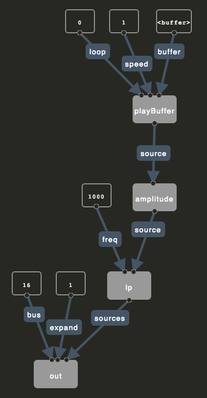

# Computational Materialism: Cinema, Software, and Community

In this section, I propose the concept of _computational materialism_ and its relationship to open communities of practice. I explore how different strands of materialism operate and are systematize in my own digital cinema and music, situating my practice alongside the work of Amy Twigger Holroyd, Chris Welsby, and others. I use this idea of materialism to suggest an alternate perspective on digital technologies--one that emphasizes energy and signals over information and representation, ultimately suggesting that even computation has its own form of embodiment that can be experienced through technologically-mediated artworks.

## The Materials of Community

As described in the introduction, the software component of my project involves two primary and interrelated activities:

1. Creating videos and music such as _In Passing_, _Tofino_, and the soundtrack for _Font Màgica_, which are generated or processed by means of software that I designed and built specifically for these pieces and their idiosyncrasies.
2. Designing, developing, and sharing with a community a set of creative frameworks, _Flocking_ and _Aconite_, which were designed initially as a generalized support structure for my own creative endeavours, but grew to include use by, and support of, other artists in their own creative work

Every piece of "software art" in this project, along with the supporting technical frameworks and documentation, have been made using collaborative open community methods. Early ideas and concepts emerged via discussions with a distributed community of artists, designers, and programmers who have formed around the Fluid Infusion and Flocking communities1. In the case of Flocking, a community of perhaps one hundred people from around the world, mostly composers and sound artists, have used or contributed to it2. Even this text itself, from my first tentative notes and initial annotated bibliography through to the comments from reviewers of each section, was produced using open strategies3.

### Open as Method

Open software methods first emerged within the research software development culture of the 1970s at MIT, Berkeley, and elsewhere, and evolved into a more formalized body of practice in the late 1990s with the communities that formed to develop freely-distributed and openly-licensed software such as the Linux operating system and the Firefox web browser (Voyce 416) (Bretthauer 16). In _Wide Open: Open Source Methods and Their Future_, Mulgan, Steinberg, and Salem define open source software as "any computer software distributed under a license which allows users to change or share the software's source code. Source code is the human-readable version of a computer program" (8). It is worth noting that, even within this simple description, the predominant emphasis by open source software developers and academics alike is placed directly on the source code as an originary and authorial text. Source code is cast as the "human readable" manifestation of software, in contrast to its runtime form. This framing raises questions, of course, about the ways in which software is readable and writable, when, and by whom. These questions will be taken up below, following a brief discussion of open source methods within my practice.

Mulgan, Steinberg, and Salem note that open source methods are "at the cusp of familiar tools," often resembling conversations, formal research teams, academic scholarship, and DIY communities (15-6). Amongst the characteristics of open source methodologies described in _Wide Open_, several are particularly germane to my practice: transparency, peer review and feedback loops, and incrementalism (16). These strategies have helped to expand the networks of use and criticism for my work beyond my own local scholarly and creative communities. Work on _Flocking_, in particular, has been substantially supported by the very diverse perspectives that make up its community of users, contributors, and critics. By working transparently so that each change to the system (known as a "commit") is visible to those following the project using the Github collaboration site4, Flocking's community is able to offer feedback, advice, and critical improvements while I work.

As an artist, however, working transparently and offering up a work-in-progress openly is a strange prospect, particularly when the project is still in the early stages of conception, before it has formed from a tangle of curious intensities into an object for use, discussion, or reception. Yet, as a result of my own openness and willingness to risk visibility in the tentative stages of creation, members of the community have been motivated to share their artistic projects reciprocally. I have benefitted from this mutual exchange significantly, not only gaining new design insights into how to support the needs and processes of artists who are significantly unlike me5, but also learning new creative strategies by studying, experiencing, and working through the software art created by others in the community. For example, the approach I used while working with recorded sound in _Font Màgica_ was substantially informed by my study of granular synthesis instruments created and shared by Alex Geddie, whose music for _Constructed Land_ subtly lenses recordings of "classical" repertoire into new works that occupy a strange, buzzing, stuttering middle ground between quotation and transformation6. In the past, as an instrumental music composer, I was rarely able to have such ready access to the scores and recordings of "non-master" composers except those within my immediate (though nonetheless highly germane) sphere of artistic friendships within Toronto. To be clear, this is not an argument for global networks and against local ones; rather, it is a acknowledgement of the new forms of locality that can emerge "telesthetically" around the creative currents and capabilities of shared, networked artifacts and practices.

For me, then, the most essential characteristic of openness is not so much the availability of source code (although this is a prerequisite for other forms of openness), nor the enactment of a specific set of technical governance and legal policies, but the way that collaborative practices performed in the context of an inclusive community can engender artifacts that in some way materially embody these practices. Software that forms, to use McKenzie Wark's term, new creative "vectors for a collective becoming" (_Hacker Manifesto_ 159-60).

## Material Artifacts

As the term suggests, "open source" software development strategies, both socially and technically, emphasize source code as the locus of action and power within computation (Chun 21). Yet even the term itself--open source--is highly contested, particularly by those who identify instead with the "free software" movement. The distinction is marked by differences of legal position and political philosophy. "Free" requires, as an explicit feature of its license, that all modifications or derivations of the source code, including its combination with other works, must be distributed under the same terms as the original (Stallman 32). This is "viral" licensing, where legal requirements spread to everything a piece of software touches. Sharing is legally mandated, never a spontaneous gift. Free software advocates promote this as a legal right to freedom--"free as in speech," the ensconcement of a programmer's right to express themselves via source code, rather than the "free as in beer" of no-cost distribution (Stallman 43).

While I admire aspects of Stallman's project, I have nonetheless tried to intentionally avoid the use of the term "free" here in favour of "open." Partly, this is to avoid what I see as the increasingly blunt ideological rhetoric and overt legalism of many "copyleft" free software advocates who gravitate towards software's technical and logical construction (again, its source code), rather than its social and creative consequences--its _use in practice_. I prefer here to use the term "open community" instead of either "open source" or "free software." This term aims at the possibility that "openness"--to creative expression and personal adaptation of software--might increasingly be conceived of as a characteristic of software artifacts themselves and the communities that form around and within them, not just of source code. In other words, software has the potential, if approached differently, to form a kind of _material_ that can be worked on by means of itself, where the power to create and modify is available to all creators, not only computer programmers (Basman, _If What We Made Were Real_).

I argue that, as a result of this failure to confront the material possibilities of software,  "free software" and "open source", as methods and as a political movements, remain largely technocratic constructions. Creative control remains centralized in software's programming language source code, where only a limited community--those who have access to the specialized knowledge of computer programming--are able to benefit from its purported "liberty" and "freedom." Via my software development practice, manifest here in _Flocking_, _Aconite_, _In Passing_, _Tofino_, and _Font Màgica_, I aim to extend the values and methods of open community practice into the material of software.

## Material Change

Wendy Chun: "Richard Stallman, in his critique of nonfree software, has argued that an executable program 'is a mysterious bunch of numbers. What it does is secret.' Against this magical execution, source code supposedly provides an understanding and a freedom--the ability to map and know the workings of the machine, but, again, only through a magical erasure of the gap between source and execution, an erasure of execution itself" (51).

This Cartesian dualism that Chun refers to, source/execution, haunts computation to its core. It is implicated in a related binary that Chun overlooks, the separation of _code_ from _data_. These dualisms crucially influence the way in which software's form and potential is commonly understood today, and account for how its materiality is often overlooked or fails to actualize at all. Conventional source code, before it can be used, must be transformed into something different: a binary executable created by a _compiler_. This transformation is unidirectional; as Chun suggests, it is an act of erasure that enacts the practical gap between source code, which is understood as fundamentally changeable and authorable--the "source" of creative power--and execution, which freezes the creative act and transforms it into an object and product. While code is apparently iterative and endlessly modifiable (by those with the skills and access, anyway), executables are not. You cannot unravel a piece of software and turn it into something else.

Software has no equivalent to Amy Twigger Holroyd's _reknitting_, where existing knitted garments (most strikingly, even those that were mass-produced by machines) are modified or transformed in ways that were unanticipated by their original designers. Re-knitting, according to Twigger Holroyd, involves "a broad range of processes which can be carried out by individuals to alter existing items of knitwear. Re-knitting shifts a knitter's practice from the creation of new items to the re-making of existing pieces" ("About Re-Knitting"). These processes include unravelling, cutting, grafting, insertions, stitch hacks, and replacements (Twigger Holroyd, "The Spectrum"). With these techniques, Twigger Holroyd and her friends make marvelously uncanny and expressive machine/hand hybrid garments by grafting new designs into old jumpers and socks.

_Figure x: A reknitted cardigan by Amy Twigger Holroyd, which was created using a variety of slicing, unravelling, stitch-pickup and grafting processes in order to modify an existing, machine-made garment with her own hand-made alterations. Image courtesy of Amy Twigger Holroyd._

As an art form, re-knitting shows how new works can be created from old ones not just by reusing patterns or schematics, but at the material level. Using Wark's terminology, a reknitted garment represents not only the _content_ of the vector of knitting, but itself a new vector, or _form_, for the creation of another work from and within it. This newness is not just the result of a process of copying, quotation, or appropriation, but of the virtuality of the artifact itself--its ability to engender new forms and futures, "the immaterial virtuality of the material" (Hacker Manifesto 100).

Yet it is also worth noting that re-knitting is not simply an idiosyncratic personal practice of Twigger Holroyd or her colleagues, but "an integral part of the practice of knitting" generally, a characteristic of the medium and the traditional methods of knitting itself ("About Re-Knitting"). Even when mass- and machine-produced, knitted objects retain their modifiability and, as a result, have the ability to support a "community of practice" within themselves. As artifacts, they can be worked on by multiple creators and can support unanticipated uses and after-the-fact adaptation. It is this ability to be serendipitously added to, subtracted from, grafted onto, or unravelled in a form not already planned for and designed into the object that defines my concept of _materiality_, the latent and unrealized potential of software. This materiality represents, I think, a form of _conviviality_, what Ivan Illich identifies as the "autonomous and creative intercourse among persons, and the intercourse of persons with their environment [including tools]... individual freedom realized in personal interdependence" (_Tools of Conviviality_).

## Artifactual Materiality in Practice

I do not want to linger for long here on the technical details of _Flocking_, _Aconite_, or my software-based videos and compositions, since they are discussed extensively elsewhere7. However, I feel that it is necessary to briefly examine the mechanism by which these tools aspire to function as material vectors for further creative practices--my own and those of others.

By virtue of the manner in which they are constructed and the nature of tools with which they are implicated, my software-based videos and music compositions were developed in a different way from most conventional software. Programming typically enacts a curious separation between code and data. Code represents the "logic" and "behaviour" of a piece of software. As Chun notes, source code is usually understood as the primary active agent of computation (19). In contrast, data is passive and raw; it serves as the material from which computational representations are formed. Programming languages are designed to process data, but are not themselves easily processable8. This means that ordinary programs are unable to understand or modify other programs9. Perhaps counter-intuitively, this oft-neglected computational self-referenceability, known as "homoiconicity"--the capacity for programs to treat themselves and other programs as data, and thus, to self-modify--is the prerequisite for individuals and communities (not just algorithms) to more directly participate in a convivial relationship with their software materials, bidirectionally as both users and creators (Basman et al 255).

Programs made with Flocking and Aconite are data, not just code. This means, in particular, that they can be "understood" by programs and modified algorithmically as data, using the strategies that are typically used for other kinds of data processing. One particular technique is used extensively in Flocking programs to make them more amenable to material transformation: merging. In Flocking, instruments and signal processors are defined as "trees" of data that represent the connections amongst individual "unit generators," or signal producing/modulating algorithms. Even the compositional or "meta-level" material of a piece can be defined as a tree of signals, as in _Font Màgica10. By structuring a program as nested collections of named values, simple algorithms can be created (including the ones that are built directly into Flocking and its underlying support infrastructure) to "graft" or merge different signal trees together. A given instance of a signal tree created by one artist can be reconfigured without "forking" or changing the original source11, nor requiring there even to be an intent or active design to support such adaptation. Where free software legally mandates sharing, code-as-data participates in a form of implicit, integral gift economy where each work holds the potential to serve as the material for new ones.

Like Amy Twigger-Holroyd's spectrum of treatments for knitted objects12, merging and other data processing strategies in Flocking provide a means to materially transform the nature and logic of a program, allowing its capacities and energies to be changed, re-channeled, or vectorized into new artistic forms. Notably, this "graftability" of my software can increasingly be applied at any point in the creative life of a program, from its inception as source code right up to the runtime manifestation of a program13.

    {
        "buffer": "chopin-left",
        "speed": 1.0,
        "loop": 0.0,

        "synthDef": {
            "ugen": "flock.ugen.out",
            "bus": 16,
            "expand": 1,
            "sources": {
                "ugen": "flock.ugen.filter.biquad.lp",
                "freq": 1000,
                "source": {
                    "id": "volume-tracker",
                    "ugen": "flock.ugen.amplitude",
                    "source": {
                        "ugen": "flock.ugen.playBuffer",
                        "loop": "{that}.options.loop",
                        "speed": "{that}.options.speed",
                        "buffer": "{that}.options.buffer"
                    }
                }
            }
        }
    }
Example x: _An example of how signal processing programs are represented in Flocking. This program's signal is used to determine the overall compositional structure of_ Font Màgica. _It represents an instance of "declarative" data flow programming, where a collection of unit generators are specified within a loosely schematized data structure to: 1) read an audio file's signal from a "bus", 2) track the volume of the incoming audio, and 3) smooth the output of the amplitude tracker using a low-pass filter._

Figure x: _An illustration, generated using Flocking's interactive textual/graphical programming environment, of the meta-level structure of_ Font Màgica.

Secondly, Flocking and Aconite programs are constructed using a rich network of "landmarks," or names, which provide stable references into every point of composition in a program. Traditionally, names in software are either inward-facing constructs or pseudo-legal contracts, designed to make it easier for a team of programmers to understand their code or to provide other programmers with a fixed repertoire of actions that can be performed with a piece of software. Computation fastidiously covers its tracks; composition too often simply erases its components. In contrast, works made with Flocking and Aconite bind each point of composition and behaviour to a name, a stable referent to which changes can be targeted, items can be removed, or new activities injected. Where ordinary function composition is smooth, leaving no traces, textures, or seams, my programs are woven with names; they provide the means to open the seams, unravel the material, and pick up the computational stitches to make something new.

## The Material Commons

So if the central quality of materiality here is the ability for something to be remade into something new without having been intended as such, what happens to the original? Channelling Heidegger for hiphop, Charles Mudede understands this transformation (something into its unintended) as arising from breakage, which brings to light the inner, unrecognized potential of an object. The broken object, now marvellously _enstranged_, has been knocked "out of the slumber of its primary function... it is now wide-awake, alert, alive" ("The Turntable"). To make its meta-music, the turntable must, in some way, fail to function as intended. Twigger Holroyd's knitted transformations are irreversible--the transition from jumper to cardigan is permanent, invariably involving some form of creative destruction to enact its renewal. But turntables and sweaters are objects with a very high degree of materiality, indeed. The digital is surely somehow different. Adapting Mudede's poetics, my artistic software aims at becoming hypnagogic media: alive at the threshold between sleep and consciousness, able to move in either direction, to wake up into something new or fall back into the same dream without shattering in transition14. Right now, my own pieces are slumbering on Github15, waiting to be awoken as the vector for a new work of art by me or someone else.

Whatever happens to the turntable and the analogue vinyl record, James Brown, after all, is never broken by a digital sampler's manipulation of him, nor is his (or the sampler's) essence somehow lost or activated by the process. Transformation is general and ubiquitous when it is digital. Although it may seem that it is digital media's reproducibility that affords such zero cost transformation without breakage, reproducibility, in itself, is just another form of breakdown. Every software programmer knows the impossible tangle of duplication that is the result of the copy/paste procedure. So perhaps it is not the digital's infinite reproducibility that allows it to avoid destruction in the act of recreation, but its capture within a logic of signals and loops: the repetition, modulation, and filtration of materials into something new. "It is this act, replaying, that marks the real rupture in the mode or method of production" (Mudede).

Echoing this idea of "replaying" and drawing it back to the theme of community, Stephen Voyce imagines a more general mode of what he calls "open source poetics," which is defined by "a decentralized and nonproprietary model of shared cultural codes, networks of dissemination, and collaborative authorship" (407). His view of open communities and their relation to art practice focusses on appropriative, readymade, remix, and "uncreative" strategies, which call into question the role of singular authorship and shift creative emphasis instead towards how poetry contributes to a "poetic commons" of textual references and transformations (408). While, as discussed above, I think it is a mistake to focus only on the citational or appropriative modes of open communities, I nonetheless want to explore Voyce's idea of a commons in which works of art serve, via quotation and systematic transformation, as the "raw materials," or signals, for new works.

Notably, Voyce argues that, underneath the agonistic and oppositional tropes of modernism, open community tactics have been an ongoing feature of avant-garde art movements such as Dada and Fluxus. For Voyce, this method of inter-authorial materiality suggests that avant-garde artists have an ongoing role and responsibility "to create and fortify public domains of open source knowledge, to challenge excessive restrictions placed on language and information, to bring forth marginalized knowledges from a position of inaccessibility to the public at large, and to produce and share artistic tactics and works that challenge intellectual property. That which is at stake is nothing less than open accessibility to culture" (427-8).

## Material Systems: Font Màgica, Chris Welsby, and Tofino

### Font Màgica

For my soundtrack to Izabella Pruska-Oldenhof's film _Font Màgica_, at her request, I used a recording of Chopin's Prelude No. 15 ("Raindrop") as source material, layering and blending it with the sound of radio astronomy events. Since Izabella had initially edited the film to the Chopin piece, I wanted to retain some of the affective logic of Rudolf Serkin's expressive piano performance in my treatment of it. Using a network of amplitude trackers and granular signal processors, the piece's formal structure, its dynamic phrasing, was used as a signal with which to modulate and filter the playback of multiple layers of the Chopin along with the astronomical sounds. The Raindrop prelude's own compositional structure was fed back into the system, refracting itself into multiple layers of sound that are eerily offset from and mis-registered to the original, but which nonetheless carry a strangely warped expressivity. Like Izabella's visuals, it is an overtly refractive piece, full of prismatic colours, distorted ghost images, and passing fragments of a receding original.

_Font Màgica_ gently sounds within a technics and phenomenology of material transformation. Neither a work _of_ traditionally-constructed originality nor one _about_ appropriation, it is a lensing apparatus, a technical-sonic system that is _complicit with_ Chopin and solar flares and Izabella's visuals and my signal processing algorithms. Though slightly different each time due to random signal changes, _Font Màgica_ is not an "open" work so much as an obsessed one. It is obsessed with its own material closing in on itself via signal processing. Chopin's _Raindrop_ appears everywhere, replicated at all levels as both a structuring force as well as a microsonic substrate. _Font Màgica_ aims for a form of systemic closure and inner self-similarity; a closure that paradoxically "realizes openness in its radical sense: not as openness toward the possibility of contingencies from the outside, but as a 'being opened' by the contingent materials that form the work" (Negarestani 3).

Algorithms paint an artwork into a corner. They limit possibilities rather than opening a work up to them. A "rigorous and twisted mode of closure," algorithms allow a work to close in on itself and its materials (2). Too often algorithmic art is couched in a rhetoric of power and control that demands a distinctly perspectival position, like the abstract, theoretical, architectural view from above in De Certeau's reading of the city from the top floor a skyscraper (92-3). For me, algorithms are not about the control afforded by such an over-arching perspective on a system, nor are they simply a Cageian opening up of the work to the contingencies of a constructed "nature" distinct from the technics used to register it. I use algorithms in my work specifically in order to have my view of the aesthetic terrain partially obscured, to find localized energies that emerge not from the abstract adherence to rules, nor openness to chance, but from a kind of obsessive practice that allows a creative system to start feeding on itself, to "uncover itself as the field of experimentation of its contingent materials as a conspiracy plotted by anonymous materials" (Negarestani 4).

### Chris Welsby's Colour Separation

_Font Màgica_'s soundtrack, though perhaps obliquely, invokes for me the work of Chris Welsby, whose films form "cinema systems" that bind together, both as material and method, the technology of the camera and the energies of the natural environment. In Welsby's films, the wind, waves, sun, rain, and clouds all are allowed to imprint themselves onto the chemical, mechanical, optical, and durational surfaces of his cinema. Nature and technology are not opposites, but form an ecology. "Mind, technology and nature are not experienced as separate things divided along Cartesian lines but as interconnected parts of one larger, dynamic system" (Welsby, "Technology, Nature, and Software" 102).

For his 1974 film, _Colour Separation_, Welsby ran "film stock three times through a stationary camera; once for each of the light primaries. In the composite image, anything moving is represented in primary or secondary colour whilst anything still, having been filmed through all three filters, is represented in 'correct' colour" (Welsby, "Film notes for Colour Separation"). The effect is, of course, literally prismatic: the film's view of a harbour with boats floating at their mooring is refracted and multiplied into coloured layers by natural influences and the passing of time. Everything is gently in motion; boats and waves split and merge as colourful, offset ghosts that double and triple each other while they bob about in the wind and tide over the course of the film. While _Colour Separation_ could be read simply as an articulation of the structuralist mechanics of film, allowing us to see the way in which a colour image is produced within the camera, I think it is more productively understood as mild form of psychedlic lensing: it offers up a glimpse of time as it is vibrantly transformed into hue. Welsby's network of emulsion, filters, camera, and weather gloriously intensifies our perception of time, folding it into the space of the camera frame and indexing its passing with colour. _Font Màgica_, I hope, analogously deploys its systemic transformations to bring out the in-between moments, the ghosts and stutters of Serkin's piano playing, multiplying it into layers of shifting sound colour.

### Tofino

_Tofino_ takes up Welsby's spatialization of time and his wind-camera coupling to create a somewhat different kind of system. It consists of a series of long takes of breaking surf captured at Wikaninnish Beach near Tofino, British Columbia. The first part of the video is structured as a "temporal panorama": each static shot moves the camera a frame or so to the right, cumulatively representing a 180° view of the beach16. Space, in a sense, is temporalized by the way the shots are sequenced. Time, too, is spatialized in _Tofino_. Two versions of each shot are composited or layered together: one layer runs at the standard 24 frames per second (cinema's "real" time), while the other layer gently speeds up and slows down in an oscillating rhythm. A simple Flocking signal generator, which outputs a slowly-modulated triangle wave, is connected to the playback rate of the latter video layer, causing it to move faster and slower in a motion that echoes the swell and break of the waves on the beach. Composited together, we see the two timelines moving in and out of phase. When the modulated layer runs more slowly than realtime, we see breaking waves echoed moments later by their composited ghosts. When it moves faster, actions are anticipated ahead of "real" time: we see a future.

This technical-elemental coupling uniquely makes visible, in a way that might not be possible without such an a video apparatus, the otherwise invisible mutability and bidirectional flux of time. Or perhaps this system actually brings into being--makes real--a new kind of time via its mediations and modulations?

The effect can be disorienting. As a result of _Tofino_'s temporal phasing, cuts occur at different times in one layer than in the other, causing a new shot to be dizzyingly overlaid on top of the previous one for a period. Throughout, the camera is resting directly on a wooden ledge and is frequently buffeted the strong winds, causing it to shake and shift its position. At these moments, the layers are further deregistered, emphasizing the phasing and doubling effects and evoking a disorienting "double vision" effect that hints at the proprioceptive ambiguity of Ernie Gehr's Side/Walk/Shuttle discussed earlier.

_Figure x: A video still from_ Tofino.

Jean Epstein, writing in 1946, imagined that the cinema's mechanical-perceptual apparatus, with its strange capacity to materialize time, represented a new form thinking: "This machine that stretches or condenses duration, demonstrating the variable nature of time, preaching the relativity of all measures... Without it, we would see nothing of what time might feel like materially... [it is] a form of thinking by the rules of analysis and synthesis that, without the cinematographic apparatus, humans would have been incapable of implementing" (18). Epstein's "intelligence of the machine," envisions cinema as a transformational technics that couples with human perception. As Bernard Stiegler later describes it, "cinema weaves itself into our time; it becomes the temporal fabric of... unconscious consciousness" (11). Here, however, the nature of the system and its slow and methodical unfolding suggest a model of cinematic time that is not just coextensive with our own time, but actively modulatory of it; the temporal fabric of a "conscious consciousness" of active and self-aware viewing. I will pick this thread up again in the next section when discussing _In Passing_.

## In Passing: Energy, Duration, and Embodied Technics

_In Passing_ (2015) is an eighteen-minute video consisting of three close-up shots of a dried-out leaf on the floor of my apartment. It is the kind of scene that would have been easy to miss: an old leaf had blown into the house on a windy summer day and became tangled in cobwebs in the corner, flickering aimlessly with the breeze. There is nothing particularly profound about the scene, no narrative or metaphorical schema motivating its capture on video. It was simply there, nearly but not quite lost amidst the quotidian activities and distractions of life at home.

Up close, the texture of the leaf is particularly visible--its ridges and curls, growths and cracks. Behind it, the linoleum tile floor is also thick with texture and grit. Over the course of the first shot, which is the longest of the three, the leaf's texture is amplified and granulated by digital processing. Eventually, it becomes apparent that the leaf is gradually disappearing, the algorithmic process eroding it away to reveal the floor beneath it. Leaf and linoleum, figure and ground, flatten and merge. The leaf eventually blows across the floor to the other side of the frame. Just before its outline fades from view completely, it is swept out of the frame by a sudden gust of wind. After several moments spent in its absence, there is a cut. The leaf returns, seen from another angle. We hear a crackling sound, analogous in quality and rhythm to the leaf's granulation in the previous scene. In this case, though, the digital intervention (the sound) is additive, rather than subtractive. The leaf remains intact. In the final scene, the leaf is once again seen from a different angle. Silent once more, the visual erosion has returned. This time it is apparent that the digital processing is eating away at the entire scene, not only the leaf. More quickly than before, the leaf again fades to nearly nothing and then is caught by the wind and blown out of the frame. The video ends.

_Figure x: A video still from_ In Passing.

This description of _In Passing_ highlights several aspects that are relevant to a discussion of its particular embodied technics. First, it is a long, slow, and arguably repetitive video. There is no story to escape into, no self-effacing narrative or expressionistic flow. It takes time and demands attention. Some may call it "difficult art," though I don't find it so. Secondly, the video draws together several forces: the natural energy of the wind and the leaf's hapticity on one hand, and the technological mediation of the camera’s framing and editing along with the modulatory capacity of the digital signal processing algorithm on the other. Once coupled to the embodied perception of the viewer, _In Passing_ forms, yet again, a kind of system in which natural, technical, and bodily energies co-mingle over time. It is an aggregator and modulator of these forces. In this system, the camera serves as a means to amplify the small energies of everyday life, while the processing shifts and expands them. The viewer activates the system, transforming these energies with their eyes, ears, and bodies.

_In Passing_ suggests that a work of art can function differently, perhaps, than one might traditionally expect; as more than just a static object for aesthetic contemplation. As with Jack Chambers' embodied technics of _perceptual realism_, it is a system to see (and hear) with, a means to generate and transform experience.

"Perceptual realism incorporates two systems of technology (historic and industrial) and two systems of visibility (body and mind) to structure a reflector-object of experience... two inter-working processes motivate and advance one another intentionally to create this transmitter unit... The closure of these two extending systems... creates its own object. It is an object to see with, rather than a thing just to see" (Chambers 41-2).

While Chambers uses the term "object" here, he is nonetheless suggesting that the work of art can serve as catalyst for an ongoing process of perceptual transformation within everyday experience. In a suitably dark room and with sufficient attention, the continuously shifting, stochastic sparkles of _In Passing_'s digital processing have a way of entering into a viewer's persistent vision, activating a mode of seeing that continues beyond the video's duration. Sparkles can be seen (and imagined) in anything, even with eyes closed. This model shifts the art, by means of an engaged and embodied viewer, beyond the temporal and spatial frame of the video and out into the world. It thus functions as a medial extension < IS THIS EXTENSION, OR ACTUALLY THE NATURE OF PERCEPTION (TO PARTICIPATE IN TECHNOLOGICAL/BODY COUPLINGS) > of our seeing and hearing, a sort of perceptual synthesizer (perhaps this what Chambers mean by a "transmitter unit?") that modulates the carrier wave of perception with the work's own oscillations. A system of creative, reciprocal, and active seeing that continues to operate in the world. "My eye... being instrument for striking sparks, is bequeathed visions at every illumination... Similar vistas being available to any viewer willing to release his eye for comparable movement" (Brakhage 26).

Arguably, _In Passing_'s eighteen-minute timespan is only marginally sufficient (if at all) to activate such a "system to see with." Nonetheless, its duration, coupled to its highly reduced visual vocabulary, slow pace, absence of narrative, and preponderance of silence, has the tendency to mark or make prominent our embodiment. Even as seated and relatively still cinema-goers, we notice our bodies. < DAVID'S COMMENTS ABOUT REDOUBLING THE BODILY AWARNESS HERE >

With the absence of sound and story, the experience of time in _In Passing_ is concentrated into a curious form of waiting. It suggests a modality of time that, as Howard Schweizer describes it, "must be endured rather than mastered, felt rather than thought" (23). Our usual conception of waiting is, of course, highly bound up with associations of discomfort, frustration, lack of attention, and of temporariness--a passing through rather than lingering. But while waiting certainly fails, it does so radically. It fails to achieve, to direct, to participate in the capitalistic drive of accomplishment, success, and productivity (8). It opens time up. This form of waiting foregrounds our bodies, allows us to experience duration creatively and aimlessly, rather than instrumentally. It is not about "how we pass through waiting, but how we are in it... the quality of waiting as such" (11). _In Passing_, like _Tofino_, manipulates its temporality, transforming this particular moment in time by stretching it and folding it onto itself in layers; the leaf’s presence and absence occurs simultaneously. We experience time's transience and can occupy its passing, carrying something of it away with us. < BRIEF DISCUSSION OF ELDRITCH HERE >

This ambivalence of waiting, of time alternatingly passing by in distraction and thickening with attention, forces us to contend with our bodies in the present moment, whether shifting in our seats or hearing our own breathing. Boring or not, we are in it, and aware of it. This waiting is also a reminder of our own passing. Our time is coextensive with that of the leaf. "The body that endures... is always also a reminder of its mortality" (Schweizer 17).

While _In Passing_'s "system to see with" is outwardly transformational, capable of changing a viewer's sense of time and perceptual energies, it also operates its own internal mode of transformation at a technical level. The image processing algorithm that causes the leaf to slowly erode is driven by two time-varying values: the threshold, which specifies the degree to which the leaf should be consumed by its background, and the noise seed, a value that influences the random sparkle pattern and its rate of change. These parameters are generated by a digital synthesizer, a software component ordinarily intended to generate sounds, which has been repurposed to modulate the parameters of the visual transformation of the leaf. In the second section of _In Passing_, the crackling sound is produced by connecting this synthesizer directly to the speakers instead of to the visual effect. Here, the synthesizer acts as a flexible "translation mediator," to use Don Ihde’s terminology (112), mapping the sonic to the visual and back again.

_Figure x: Diagram illustrating the signal path of oscillators and modulators in In Passing's synthesis algorithm.

Yet there is something troubling to me about Ihde's idea of translation, at least when thinking about how _In Passing_ operates. The idea of translation is predicated upon an informational model of the digital (an admittedly very dominant model at the heart of the system, as illustrated by the definitional term "information technology"), rather than one of the energetics, signals, and flows described earlier. Ihde's translational mediation is based on an abstraction of data from its representation. "To become available the information, data, or image must be transformed, translated, into what is open to our anthropological constant, an embodied human" (113). The power of Ihde's model is that it positions embodiment centrally within the realm of the digital, but it also carries with it a sedimented transmission model of communication, positioning data "above" representation as a (relatively) stable referent or message preserved within a linguistic system of translation.

Indeed, _In Passing_’s repurposable synthesizer algorithm can be interpreted informationally as proof of data's translatability across representations--we successfully both see and hear its influence. However, Bruno Latour offers an alternative concept of transformation, one that rejects the idea of data as raw material. He argues that there is no such thing as information, "there is only transformation. Information as something which will be carried through space and time, without deformation, is a complete myth" (Lovink and Shultz).

Instead, he proposes a model in which representations participate in an aligned network of transformations--"immutable mobiles" that represent the "constants carried intact through the transformation of the media" (Latour 425). Data is no longer static, objective, and at a distance from representation (or perhaps more accurately, no longer even distinguishable from it), yet meaning can still emerge from the alignment of constants across a series of transformations. "What is kept constant from one representation to the next is morphed, quite naturally, into the thing itself" (427). However, the challenge of Latour’s model is that it is profoundly difficult, in practice, to identify and register these constants across transformations. This is, in part, the creative gambit of _In Passing_, the activity embedded in its perception--to recognize and extend this network of transformations. _In Passing_'s immutable mobiles, left open for viewer engagement, are the pulsations and vibrations of its various energies--its rhythm, pacing, and durational unfolding--while its algorithms act as modulators of this energy as it is passed back and forth between visual and sonic mediators. Here, there is no information, only energy, duration, and embodiment.

## Medial Bodies

Computers are fiercely abstract machines. But, as I have argued, they also have the potential to be material; computation has a body. This body, I believe, extends beyond the circuits and electrical currents running through the silicon and wire of the computer itself, in contrast to what Kittler would have us believe with his strange and wonderful assertion that "there is no software" (CITE). This mechanical/electrical physicality is certainly true in some sense, but it is as reductive a model as the idea that our own human bodies are simply the cellular and chemical parts that compose them.

This computational body is best seen, perhaps, through works of art. Software, though so often conceived of as representational or simulational in character, has real effects in _this_ world--it influences and can be influenced by our own bodies and perceptual apparatuses. It is true that we may not be able to directly touch a piece of software, but it undoubtedly has effects and a texture of its own. <cecchetto and sound as one example of an unruly bod>, and then the argument via Mitchell and Hansen that all perception--the visual perception of my cinema, for example--ultimately conects with an inner hapticity and sense of touch--by looking at the surface of my videos (and it's not only a surface--the reflection of the projector's beam through the space, illuminating the dust in its path), we are in some sense, via a distinctly technically-co-mingled perception that is entirely human, touching them and the software algorithms within them--these algorithmic energies, too, touch us with their light, duration...

I want to take this concept of materiality as spontaneous or unplanned modification of or creation from an artifact--a form of virtuality in the sense of a potential to become something new, something other--and try to generalize it a bit, to squint at it and see what kinds of insights it provides to my cinema in general, not only those works that were created using my own software...

* the body of cinema--light, spatial coextensivity, duration--link this to the relational body of sound in Cecchetto
* Jane Bennet, poetry's body
* computation and cinema both are often understood as predominantly _representational_ in nature, and I believe that computation shares with corporate cinema its too-often fictional character
* Wark: "the virtuality of expression. Representation always mimics but is less than what it represents; expression always differs from but exceeds the raw material of its production" (103).
* Elder: "When a representation conveys information about an object, it does so by classifying it, by making it an instance of one or more kinds of entities recognized by the culture whose resources are drawn upon by the process through which representations are constructed" (308).
3. Propose, based on Jane Bennett ("Texts are bodies that can light up, by rendering human perception more acute, those bodies whose favoured vehicle of affectivity is less wordy: plants, animals, blades of grass, household objects, trash") and Mark Hansen ("all reality is mixed reality", "technics are co-constitutive of our embodied perception"), that computation is itself embodied: software has a body, and enacts real bodily effects/affects in the world

THE KEY TO ALL OF THIS IS NOT SO MUCH THAT THE MATERIAL ASPECTS OF SOFTWARE ARE SOMEHOW THE SUBJECT OF MY VIDEOS, BUT RATHER THAT THE PERCEPTUAL EXPERIENCE, AND THE TECHNICS THAT CO-CONSTITUTE OUR PERCEPTION OF THE REAL, DOUBLES THE MODIFIABILITY OF SOFTWARE--THAT IT IS THESE TWO FORMS OF TRANSFORMATION--TECHNICAL AND PERCEPTUAL--THAT GIVE MY WORK ITS BODY, AND WHICH CREATES A COMMUNITY OUT OF AND WITHIN THESE ARTISTIC ARTIFACTS.

## Notes

1. I am particularly indebted to the conversations within (and about) open source collaborative forums that I have had over the past several years with Dr. Antranig Basman, lead research architect at Raising the Floor International; Dana Ayotte, an artist and inclusive designer at the Inclusive Design Research Centre; Michelle D'Souza, senior inclusive developer at the IDRC; Dr. Clemens Nylandsted Klokmose at the University of Aarhuis; my primary advisor, Dr. Adam Tindale; and others.

2. This figure is based on interpolating between the number of "forks" of the Flocking repository on Github (thirty seven as of January 30, 2016), representing people who have in some way modified the source code (https://github.com/colinbdclark/Flocking/network/members), and "stargazers" (currently 297), consisting of people who have declared interested in the project (https://github.com/colinbdclark/Flocking/stargazers).

3. The full history of changes to this thesis over time can be seen in its "version control repository" hosted on Github: https://github.com/colinbdclark/mfa-thesis/commits/methods.

4. Github is "a code-hosting repository based on the Git version control system. Github is an iconic example of a knowledge-based workspace. This site integrates a number of social features that make unique information about users and their activities visible within and across open source projects" (Dabbish et. al. 2). Many of my research and creative artifacts, including papers such as this one, are hosted on Github at https://github.com/colinbdclark.

5. Exposing a project to a diversity of perspectives, along with an emphasis on the "value of the unpopular," are key characteristics of the inclusive design method. Treviranus argues that designing for the margins, and for difference, actually serves as a potential catalyst for innovation. See Treviranus and Hockema, _The Value of the Unpopular_, and Treviranus, _Designing for the Full Range of Human Diversity_ http://inclusivedesign.ca/about/

6. _Constructed Land_, by David Bouchard, Alex Geddie, Bruno Lessard and Pierre Tremblay, was exhibited in 2012 at Interaccess in Toronto. Documentation of the installation, including some of Alex's music, is available at http://nunavutlights.com/. My own Flocking "port" of his SuperCollider instruments, which were foundational to me as both technical exemplars as well as aesthetic ear-benders, are available at https://github.com/colinbdclark/compositions/tree/master/alex-kimmirut

7. I wrote about Flocking's design and architecture in detail in "Flocking: A Framework for Declarative Music-Making on the Web" (Clark and Tindale). The underlying software development idioms and philosophy employed within Flocking and Aconite are described in "Harmonious Authorship from Different Representations" (Basman et al) and in "To Inclusive Design Through Contextually Extended IoC" (Basman et al).

8. Chun, strangely, neglects to examine this issue, choosing instead (as most programmers do) to take the code/data distinction as a given. LISP, however, was the first and paradigmatic language to challenge this; other languages and environments (including my own) have followed. The index of _Programmed Visions_ omits LISP entirely, and Chun limits herself to only a passing reference to John McCarthy and his language, apparently missing the point that it's interactivity wasn't simply a function "of the limitations of procedural programming" (61), but rather a features of its ability to self-reference. For me, the language represents the leak in her schematic regarding the evolution of computation from an emphasis on execution on a specific machine to its erasure by source code. LISP is an environment in which code is represented _as data_, which means that its "source" is changeable by the program itself or by other programs. LISP programs are LISP data structures; this characteristic is known as "homoiconicity," and opens up the possibility that programs, not just data, can be transformed and modified by other programs (Basman et al 255). Complicating the narrative of Chun's argument, LISP fails to maintain the ideology of code as "originary" text, since the materials of a software program is itself available to be modified during the process of interpretation and use.

9. There is a special class of programs, such as parsers, interpreters, code generators, and compilers, which are capable of "reflecting upon" or manipulating traditional non-declarative source code, and which can potentially be used to support programmatic modifiability. However, these tools often do not provide a reliable means for interacting with them and are typically unidirectional; they exemplify, to varying degrees, exactly the kind of erasure that Chun says plagues our models of computation today.

10. This architecture, in which all aspects of a composition are represented as "signals" that can be modulated freely by other signals, both at high and low frequencies (i.e. on the scale of both timbres and the over-arching stucture of a piece) is derived from James Tenney's early computer music composition work at Bell Labs in the early 1960s (Clark and Tindale 1554).

11. In open source software development, a "fork" is a split in the community that manifests itself in a systematized failure to share a single artifact. As diverging features are introduced to one or the other source code forks, the result is often a break in the linkage between the two pieces of software, making them incompatible. In contrast, Flocking's goal is preserve as best as possible the linkage of software artifacts even when faced of diverse and conflicting goals, requirements, and approaches. This is achieved in part by allowing differences to specifically be represented, named, and addressed within the system.

12. Twigger-Holroyd's spectrum of re-knitting treatments describes a variety of strategies and techniques for modifying existing garments. She has produced a wonderful diagram illustrating these techniques and their relationships. http://www.keepandshare.co.uk/sites/default/files/downloads/Re-Knitting%20spectrum.pdf

13. For example, Flocking's "live" programming environment is increasingly capable of applying changes to a running signal processing graph, blurring the classical source/execution, creation/use pair of distinctions. I have performed live with an early version of this system, though I retain a number of serious aesthetic and technical concerns about the ideology and practice of live "performance" coding.

14. Though hopefully such transformation holds the potential to "break" or rupture the _subject_, if not the object, in some small way. For me, this is the real potential of enstrangement: the radical change in perceptual perspective for a viewer or listener or creator or user that accompanies a change in the familiar.

15. _Font Màgica_: https://github.com/colinbdclark/raindrop-soundtrack, _Tofino_: https://github.com/colinbdclark/tofino, _In Passing_: https://github.com/colinbdclark/in-passing-video

16. The video was shot from nearly precisely the spot where this Google Maps Photo Sphere by Dave Pelletier was shot, with the camera resting on the railing of the Kwistis Vistor Centre: https://goo.gl/maps/vs3bE35MBGB2
