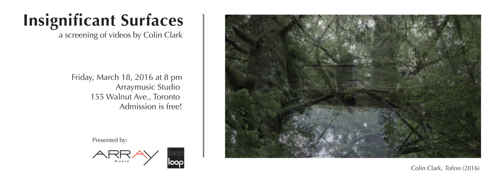

Insignificant Surfaces: videos by Colin Clark

Friday, March 18, 2016  
[Arraymusic Studio](https://goo.gl/maps/y8pKUEFJAAA2)  
155 Walnut Ave., Toronto  
8pm  
Admission is free!

The Loop Collective and Arraymusic co-present a screening of recent digital videos by Colin Clark. These durational videos quietly sound the cinematic technicity of the sea, trees, plants, animals, and people.

This event is part of an ongoing series of screenings in 2016 celebrating the Loop Collective's 20th anniversary.

Colin Clark is a video artist, composer, and design researcher at OCAD University’s Inclusive Design Research Centre. Since 2011, he has produced a growing body of digital videos that explore the relationships between technology, nature, and time, often incorporating custom-made image and sound processing techniques. His music has been performed by Arraymusic, the neither/nor collective, the Draperies, and his own ensembles, Lions and Fleischmop. Colin's soundtracks for experimental films by Izabella Pruska-Oldenhof and R. Bruce Elder have been shown at film festivals internationally. He has curated exhibitions with the Loop Collective featuring the work of Chris Welsby, Michael Snow, John Cage, and others. Colin also develops Flocking and Aconite, web-based creative software tools for sound synthesis and video processing used by artists and musicians around the world.

## Programme:

### Fall

#### Digital Crickets
2014
3 minutes
HD video, sound

A foggy fall walk in Bellevue, Washington.

#### In Passing
2015
18 minutes
HD video, sound

#### Font Màgica
by Izabella Pruska-Oldenhof, music by Colin Clark
2016
6 minutes
HD video, sound

"This film is a memory trace of a unique moment on an ordinary September evening near Montjuïc Mountain in Barcelona.

Font Màgica continues my ongoing interest in the protocinematic performances and light technologies used by artists at the turn of the 20th century. The footage for this film was shot in the Fall of 2004, when I was in the midst of my film fugitive l(i)ght (2005), which explored the electric light performances of Loïe Fuller from the same period. Font Màgica means magic fountain in Catalan language. It was designed by Carles Buïgas and completed in 1929 for the International Exhibition in Barcelona. Light fountains (also sometimes called musical fountains) were popular at the turn of last century and were often built in conjunction with major international exhibitions, for example Křižík's Fountain in Prague completed in 1891 for the World Exhibition and the fountains for the 1889, 1900 and the 1931 International Expositions in Paris. Just as the World Fairs attracted masses of people to its international pavilions, so too did the choreographed electric light and music spectacles of the musical fountains at these international exhibitions, and till this day. In many ways, these musical fountains anticipated the visual music films of experimental filmmakers like Viking Eggling, Hans Richter, Oskar Fischinger, and many others who continue in this tradition today.

Music for Font Màgica was composed by Colin Clark, Toronto-based composer and software developer, with the original piano composition by Fryderyk Chopin, Prelude Op. 28, No. 15 "Raindrop," and sounds courtesy of Stanford Solar Center (Sun sounds) and of NASA, Cassini-Huygens mission (radio emissions from Saturn)." - Izabella Pruska-Oldenhof

#### Indian Horse
2015
10 minutes
HD video, silent

On the boat, Darcie reads Indian Horse by Richard Wagamese. I watch, and look out the window.

### Winter

#### Freezing
2015
9 minutes
HD video, sound

On the cusp of winter, at the shore of Lake Huron, everything is starting to freeze: the beach, my camera (in various ways), and me.

_Intermission_

### Spring

#### Everything is Awake!
2014
4 minutes
HD video, silent

Springtime on the shore of Lake Huron.

### Summer

#### By the Fire
2014
4 minutes
HD video, silent

#### Tofino
2016
28 minutes
HD video, silent

#### How Long Will We Live?
2016
3 minutes
HD video, silent
